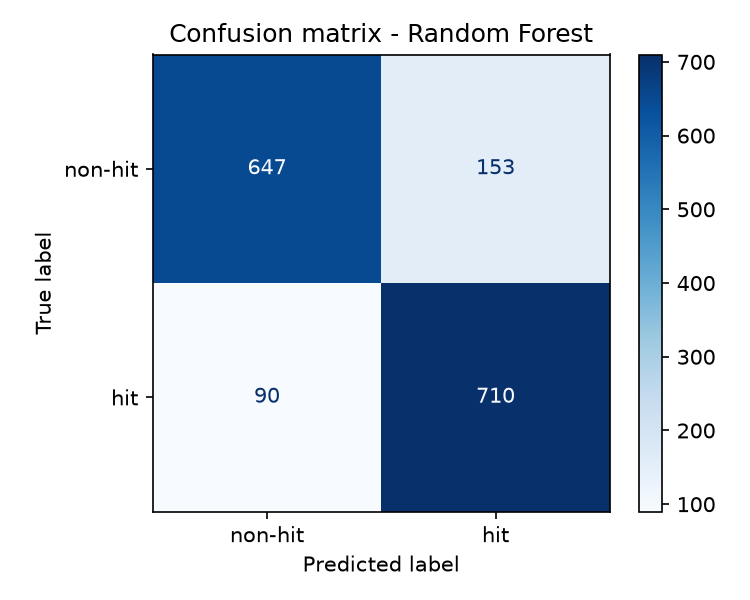
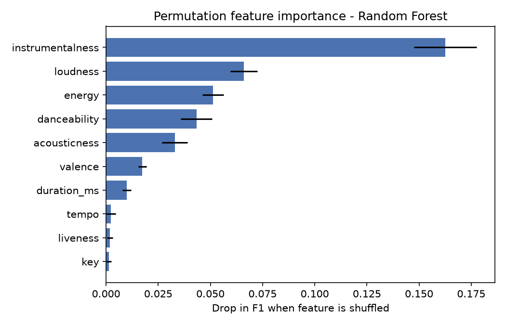

#  Predicting Hit Songs Using Machine Learning
 
Binary classification of songs as **hit (1)** or **non-hit (0)** from audio features.
Mini-project for **UE24CS352A – Machine Learning**, inspired by the Stanford CS229 report
*"Predicting Hit Songs Using Repeated Chorus"* (Liu, 2021).
 
**Best model: Random Forest → 84.81 % test accuracy, 0.854 F1** on 1,600 unseen songs.
 
---
 
## Team
 
| Name | SRN |
|------|-----|
| _P Mahema Sai_ | _PES2UG24AM107_ |
| _Teammate Name_ | _PES2UG24AM809_ |
 
---
 
## Overview
 
The CS229 paper asks whether the repeated chorus ("hook") is what makes a song popular, but its dataset is
not public. We re-implemented the same workflow on an open labelled dataset:
 
1. Prepare the data and standardise features
2. Tune and compare **8 classifiers** with 5-fold cross-validation
3. Select the best model by cross-validated F1 and save it
4. Predict hit / non-hit for new songs
5. Analyse errors with a confusion matrix and permutation feature importance
We also built a separate **raw-audio pipeline** (PyChorus + Librosa → 518 chorus features per song) that follows
the paper's approach. It was tested separately; the results below come from the dataset experiment.
 
## Dataset
 
[Spotify Hit Predictor Dataset](https://www.kaggle.com/datasets/theoverman/the-spotify-hit-predictor-dataset) (Kaggle),
file `dataset-of-10s.csv`:
 
- **6,398 songs** from the 2010s, perfectly balanced (3,199 hits / 3,199 non-hits)
- Hit = appeared on the Billboard Hot-100
- Features: danceability, energy, key, loudness, mode, speechiness, acousticness, instrumentalness, liveness,
  valence, tempo, duration_ms, time_signature, chorus_hit, sections
- `track`, `artist` and `uri` are dropped, so models never see artist names
## Results
 
75/25 stratified split, 5-fold CV grid search scored on F1.
 
| Model | CV F1 | Test Accuracy | Precision | Recall | Test F1 |
|-------|:-----:|:-------------:|:---------:|:------:|:-------:|
| **Random Forest** | **0.8514** | **0.8481** | **0.8227** | **0.8875** | **0.8539** |
| Gradient Boosting | 0.8472 | 0.8400 | 0.8148 | 0.8800 | 0.8462 |
| Neural Network / MLP | 0.8366 | 0.8219 | 0.7864 | 0.8838 | 0.8323 |
| RBF SVM | 0.8349 | 0.8106 | 0.7613 | 0.9050 | 0.8270 |
| Logistic Regression | 0.8241 | 0.7969 | 0.7519 | 0.8862 | 0.8135 |
| Linear SVM | 0.8225 | 0.7906 | 0.7332 | 0.9138 | 0.8136 |
| LDA | 0.8185 | 0.7725 | 0.7088 | 0.9250 | 0.8026 |
| Polynomial SVM | 0.8146 | 0.7981 | 0.7416 | 0.9150 | 0.8193 |
 
CV F1 (0.8514) and test F1 (0.8539) are almost identical, so the model is not overfitting.
 
### Error analysis
 

 
The model finds 710 of 800 hits (recall 88.75 %) but flags 153 non-hits as hits, so it slightly over-predicts hits.
 

 
**instrumentalness** is by far the most important feature, followed by loudness, energy and danceability.
Tempo, liveness and key carry almost no signal.
 
## Project structure
 
```
hit-song-prediction/
├── data/                  # dataset CSVs (see Dataset)
├── models/                # best_model.joblib, results.csv, charts
├── src/
│   ├── train_models.py    # train + compare 8 models, save the best
│   ├── predict.py         # 1 = hit / 0 = non-hit for new songs
│   ├── analyze.py         # confusion matrix + feature importance
│   └── extract_features.py# raw audio -> 15 s chorus -> 518 features
├── docs/                  # project report (.docx)
├── requirements.txt
└── README.md
```
 
## Setup
 
```bash
git clone https://github.com/<username>/hit-song-prediction.git
cd hit-song-prediction
 
python -m venv venv
# Windows:    venv\Scripts\activate
# Mac/Linux:  source venv/bin/activate
 
pip install -r requirements.txt
```
 
Download `dataset-of-10s.csv` from Kaggle and place it in `data/`.
 
## Usage
 
**Train and compare all models** (takes a few minutes):
```bash
python src/train_models.py --data data/dataset-of-10s.csv
```
 
**Predict on new songs** (CSV with the same feature columns):
```bash
python src/predict.py --input data/new_songs.csv --output predictions.csv
```
 
**Error analysis** (confusion matrix + feature importance):
```bash
python src/analyze.py --data data/dataset-of-10s.csv
```
 
**Raw-audio pipeline** (optional, needs `librosa` and `pychorus`; `labels.csv` has columns `filename,target`):
```bash
python src/extract_features.py --audio_dir audio/ --labels labels.csv --out data/chorus_features.csv
```
 
## Limitations
 
- Popularity also depends on artist fame, marketing, social media and release timing, none of which are in the data.
- Hits and non-hits are not matched by artist, so features like loudness and instrumentalness may partly reflect
  production style rather than the song itself.
- Only 2010s songs are used; results may not transfer to other eras.
- The ~85 % accuracy is **not directly comparable** with the paper's ~58 %: the paper used chorus-only low-level
  audio features on 554 artist-matched songs, which is a much harder task.
## Future work
 
Add non-audio factors, train on chorus features from a larger audio collection, and try CNNs on spectrograms.
 
## References
 
1. E. Liu, *Predicting Hit Songs Using Repeated Chorus*, CS229 Milestone Report, Stanford, 2021.
2. Spotify Hit Predictor Dataset (1960–2019), Kaggle.
